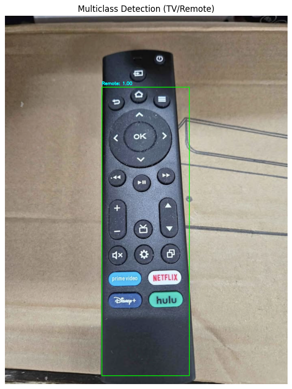

Dataset and CSV : https://drive.google.com/file/d/1hXIR266KrbTL9iRogBUJJh4AHOuga9WR/view?usp=sharing

Model 9-1, VGG : https://drive.google.com/file/d/1azpNuQFOnYvRFWp4JVXyW_7DVfnz1nA6/view?usp=drive_link

Model 9-2, Mobilenet : https://drive.google.com/file/d/1Di9vOHGrfLrmKAgg66aIXbLkS6q-j-sY/view?usp=drive_link
## 📊 Dataset Summary

| Class   | Number of Annotated Images |
|---------|----------------------------|
| TV      | ~100                       |
| Remote  | ~100                       |
| Total   | ~200                       |

### 🖼️ Image Collection
- Images were reused from **Mini Project 8**.
- Stored in `./Data/` directory as `.jpg` or `.png` or ' .jpeg'.

### 📝 Annotation Process
- Annotation was done using **LabelMe**.
- Converted to custom CSV format for RCNN training:
  - First line: object count (e.g., `1`)
  - Following lines: bounding box coordinates + class (e.g., `91 16 1676 932 TV`)
- Labels are stored under `./Data_csv/`.

### ⚙️ Preprocessing & Filtering
- During training, **all images > 3MB** were automatically skipped due to lengthy Selective Search lag.

## 📊 Training Metrics

### Assignment 9-1

### Assignment 9-2

---

## 🧪 Test Results

### test9-1

### test9-2

### test9-2-2

##  Webcam Runtime Settings

| Parameter            | Value |
|----------------------|-------|
| `MAX_PROPOSALS`      | **15**  | 
| `MIN_SIZE`           | **20 px** | 
| `NMS_THRESH`         | **0.30** | 
| `SKIP_FRAMES`        | **4**   | 
| `INPUT_RES`          | 224×224 |
| Capture resolution   | 640×480 |

laggy likely due to Selective Search，mobilenet version only slightly better but still laggy. 0-1 FPS. The app only runs detections every 5th frame (SKIP_FRAMES=4) and limits region proposals to just 15 (MAX_PROPOSALS=15). It’s barely acceptable for real-time use, usable but clearly laggy. Future improvements would require ditching Selective Search altogether

To run: python WebCamSave-rcnn-Mobilenet.py

